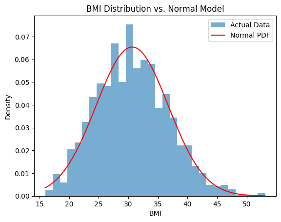
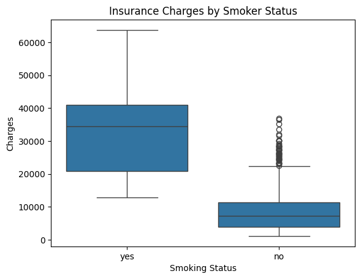
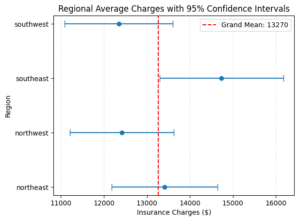

# Medical Cost Statistical Evidence


## 📌 Project Overview
This project applies rigorous statistical methods to analyze a medical cost dataset. The main goal is to uncover the underlying distributions of various demographic and health-related factors (such as BMI, smoking status, and family size) and to perform hypothesis testing to determine what truly drives insurance charges.

Through a series of probabilistic modeling and inferential statistics, this analysis provides data-driven evidence for pricing and risk assessment strategies in the health insurance domain.

---

## 📊 Key Insights & Business Recommendations

1. **The Smoker Penalty:** Smoking status is by far the strongest predictor of high medical costs. Smokers cost the company between **$22,076 and $25,155 more per year** on average compared to non-smokers (with an extremely large effect size, Cohen's $d \approx 3.33$). Premium adjustments should heavily penalize smoking behavior.
2. **Geographical Regions:** After applying the Bonferroni correction for multiple comparisons, regional differences in medical costs were found to be statistically insignificant. Pricing should *not* heavily index on geography.
3. **Age and BMI:** There is a statistically significant, albeit weak, positive correlation between age and BMI. Older policyholders (40+) have slightly higher BMIs.
4. **Family Size & Risk:** While larger families (3+ dependants) show slightly different BMI trends, the effect size is negligible. Family size is not a reliable proxy for higher health risks associated with obesity.

---

## 🔬 Statistical Methods Used

### Part 1: Probability Distributions
* **Normal Distribution:** Analyzed the Body Mass Index (BMI) of policyholders. The data fit a Normal model fairly well, with a slight right skew indicating more "heavier" individuals than expected in a perfect bell curve.
* **Binomial Distribution:** Evaluated the smoker rate. Simulated probabilities to understand the risk of having disproportionately high numbers of smokers in a random sample of 50 policyholders.
* **Poisson Distribution:** Modeled the number of dependants per policyholder. While it mostly captured the general pattern, it underestimated the proportion of larger families.

### Part 2: Hypothesis Testing
* **Welch’s T-Test & Mann-Whitney U Test:** Proved that smokers incur significantly higher medical charges than non-smokers.
* **Welch's T-Test (Gender):** Investigated differences in charges between male and female policyholders. Found a statistically significant but practically small difference (Males cost slightly more on average).
* **Pearson Correlation & Student's T-Test:** Analyzed the relationship between Age and BMI.
* **ANOVA / Pairwise T-Tests with Bonferroni Correction:** Tested regional cost differences. Showed that early findings of regional variance were merely due to family-wise error rates (Type I errors).

### Part 3: Custom Investigations
* **Gender-Specific Smoker Analysis:** Analyzed female and male smokers separately to see if the "smoker penalty" varied by gender. 
* **Large vs. Small Families:** Tested if policyholders with large families (3+ children) have significantly different BMIs compared to those with smaller or no families.

---

## 🚀 Getting Started

### Prerequisites
To run this notebook, you will need Python 3.x and the following libraries installed:
```bash
pip install pandas numpy scipy matplotlib seaborn jupyter
```

### Running the Notebook
1. Clone this repository.
2. Ensure the medical cost dataset (e.g., `insurance.csv`) is located in the same directory.
3. Launch Jupyter Notebook:
```bash
jupyter notebook
```
4. Open `22f-8814-ds-assignment-3.ipynb` and run the cells sequentially.

---

## 📈 Visualizations

The notebook contains several key visualizations that illustrate the statistical findings.

### BMI Distribution vs Normal Curve
*Shows the right-skewed nature of the real BMI data compared to the theoretical normal distribution.*



### Cost Variability: Smokers vs Non-Smokers (Boxplot)
*Highlights the massive variance and higher median costs associated with smokers.*



### Regional Confidence Intervals
*Illustrates the overlap in 95% confidence intervals across regions, proving no significant geographical pricing difference.*



---

## 📁 Repository Structure

```
├── 22f-8814-ds-assignment-3.ipynb  # Main Jupyter Notebook containing the analysis
├── README.md                       # Project documentation
├── assets/                         # Extracted visualizations
```

---
*Developed for Data Science Assignment #3.*
